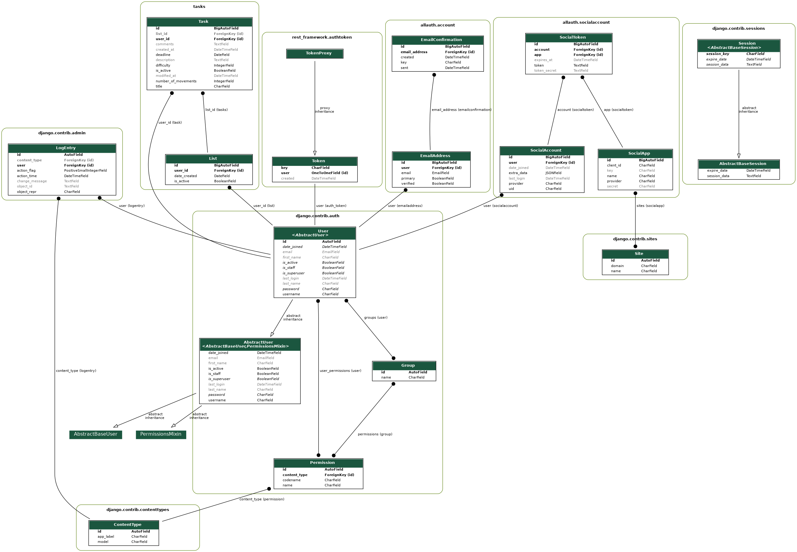

# Work Balancer Back-end

## About 

Work balancer is a web application that will help you to understand how many task you can do per a day.
Why is it necessary? 
. It allows you to increase your work planning accuracy. The more linear your working activity the easier define deadlines. 
. It reduces your working stress, over work and in the end burnout. 
. It has positive effect on your personal brand. Your clients will be more confident in work with you if they would see you as well-organised employee. 

Therefore, you can consider the application as a way to understand yourself and tune your working activity, to make yourself more efficient. 

## Documentation

### The list of API endpoints:

| Endpoint                                   | HTTP Verb | 
|--------------------------------------------|-----------|
| api/v1/task/<int:pk>                       | CRUD      |
| api/v1/tasks                               | GET       |
| api/v1/lists                               | GET       | 
| api/v1/dj-rest-auth/registration           | POST      |
| api/v1/dj-rest-auth/login                  | POST      |
| api/v1/dj-rest-auth/logout                 | GET       |
| api/v1/dj-rest-auth/password/reset         | POST      |
| api/v1/dj-rest-auth/password/reset/confirm | POST      |

Soon I will add better description, for now you can use 2 ways mentioned below.  

The full documentation you can find [here](doc/openapi-schema.yml)
or you can run the service and open /redoc endpoint 

### The database schema: 

## How to launch

1. create venv 
2. clone the repository
3. activate the venv 
4. cd into the cloned folder
5. pip install -r requirements.txt
6. python manage.py runserver